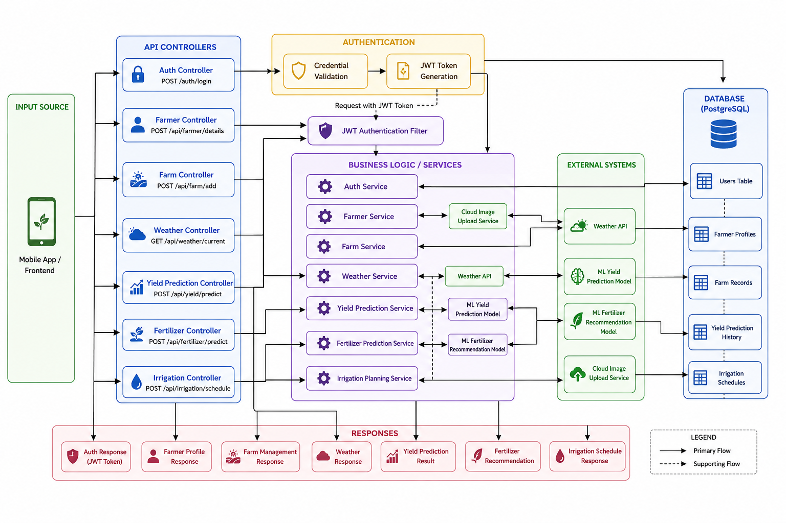
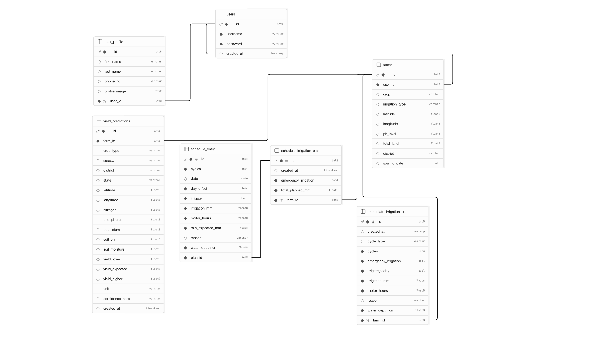
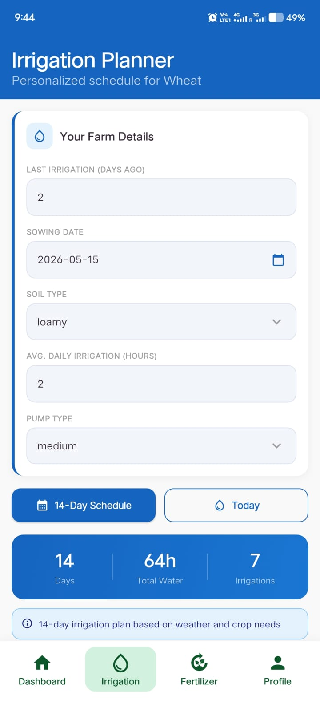
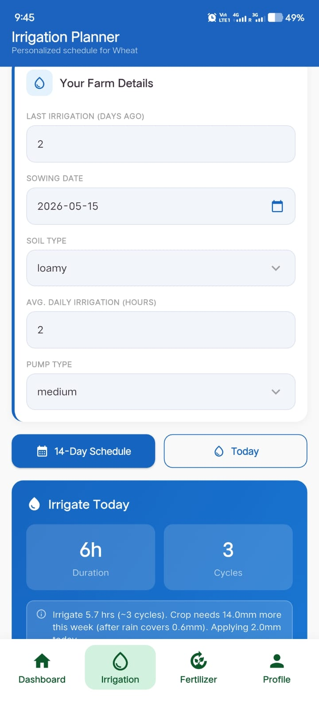
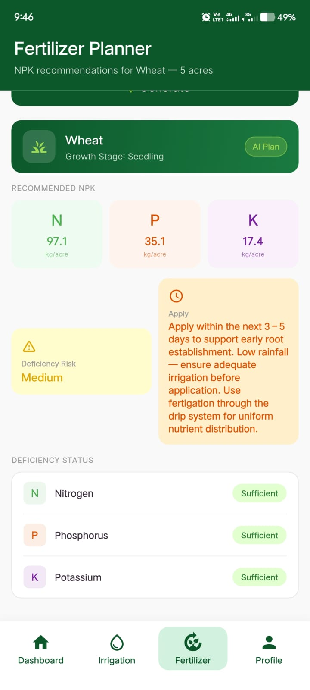
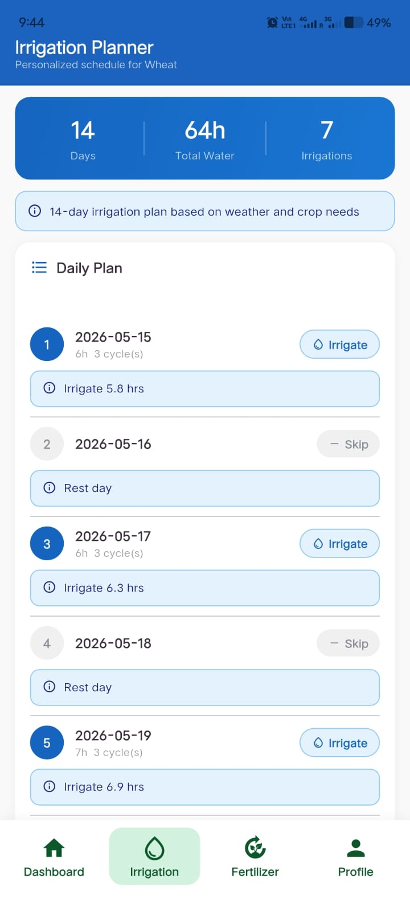
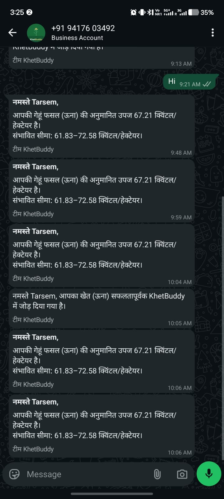
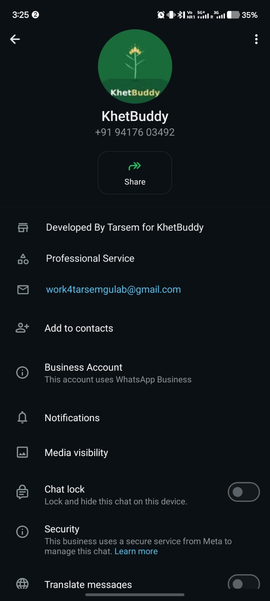

# KhetBuddy Backend 🌾


KhetBuddy is a Smart Agriculture Backend Platform built using Spring Boot that helps farmers make intelligent farming decisions using Machine Learning, Weather APIs, and Smart Automation.

The platform provides:

- Crop Yield Prediction
- Fertilizer Recommendation
- Smart Irrigation Planning
- Real-time Weather Forecasting
- WhatsApp Notifications
- Farmer & Farm Management
- JWT Authentication & Security

---

# Live Demo

## Backend URL

```text
https://khetbuddy-backend.onrender.com
```

## Swagger API Documentation

```text
https://khetbuddy-backend.onrender.com/swagger-ui/index.html#
```

---

# Key Highlights

- Production-ready Spring Boot backend
- JWT Authentication & Authorization
- PostgreSQL + Supabase Integration
- External ML Service Integration
- WhatsApp Notification System
- Swagger OpenAPI Documentation
- Cloud-based Deployment on Render
- Real-time Weather API Integration
- Layered Backend Architecture
- RESTful API Design

---

# Problem Solved

KhetBuddy helps farmers make data-driven agricultural decisions using:

- Weather-aware irrigation planning
- AI-powered yield prediction
- Smart fertilizer recommendations
- WhatsApp farming alerts

The platform reduces manual farming guesswork and improves agricultural productivity through automation and intelligent recommendations.

---

# System Architecture

<p align="center">
  
</p>

The backend follows layered architecture using:

```text
Controllers → Services → Repositories → PostgreSQL Database
```

Integrated with:

- Machine Learning APIs
- Weather APIs
- Cloudinary Image Upload
- WhatsApp Notification APIs

---

# Database Schema

<p align="center">
  
</p>

Database powered by:

- Supabase PostgreSQL
- Spring Data JPA
- Hibernate ORM

---

# Mobile Application UI

<p align="center">
  
  
  
</p>

<p align="center">
  
  
</p>

---

# WhatsApp Notification System

<p align="center">
  
  
</p>

Features:

- Irrigation Alerts
- Weather Warnings
- Yield Prediction Updates
- Fertilizer Recommendations

---

# Features

## Authentication & Security

- JWT Authentication
- Access & Refresh Token System
- Spring Security Integration
- Password Change Support
- Protected REST APIs

---

## Farmer Management

- Create Farmer Profile
- Update Farmer Details
- Upload Profile Picture
- Fetch Farmer Information

---

## Farm Management

- Add Farms
- Delete Farms
- Fetch User Farms
- Farm Ownership Management

---

## Yield Prediction

- ML-powered Crop Yield Prediction
- Weather-aware Prediction Logic
- Prediction History Tracking
- Farm-based Prediction System

---

## Fertilizer Recommendation

- Intelligent Fertilizer Recommendation
- Soil & Crop-based Prediction
- ML-powered Recommendation System

---

## Irrigation Planning

- Smart Irrigation Scheduling
- Immediate Irrigation Advice
- Weather-aware Irrigation Logic
- Automated Planning System

---

## Weather Integration

- Real-time Weather Forecasting
- Latitude & Longitude based Weather Data
- Weather Processing Engine

---

# Tech Stack

## Backend

- Java 17
- Spring Boot
- Spring Security
- Spring Data JPA
- Hibernate ORM
- Maven

---

## Database

- Supabase PostgreSQL

---

## Documentation

- Swagger OpenAPI 3

---

## External Services

- Weather API
- Cloudinary Image Upload
- WhatsApp Cloud API
- External Machine Learning APIs

---

# Project Structure

```text
src
└── main
    ├── java/com/tarsem/khetBuddy_backend
    │
    ├── client
    │   └── # External communication clients
    │
    ├── config
    │   └── # Application configuration classes
    │
    ├── controller
    │   └── # REST API Controllers
    │
    ├── dto
    │   └── # Request & Response DTOs
    │
    ├── entity
    │   └── # JPA Entity classes
    │
    ├── enums
    │   └── # Enum classes
    │
    ├── exception
    │   └── # Global exception handling
    │
    ├── external
    │   └── # External API integrations
    │
    ├── mapper
    │   └── # DTO ↔ Entity mapping
    │
    ├── repo
    │   └── # Spring Data JPA repositories
    │
    ├── security
    │   └── # JWT & Spring Security configuration
    │
    ├── service
    │   └── # Business logic implementation
    │
    ├── Utils
    │   └── # Utility/helper classes
    │
    └── resources
        └── # Configuration & static resources
```

---

# Core Modules

- Authentication
- Farmer Management
- Farm Management
- Yield Prediction
- Fertilizer Recommendation
- Irrigation Planning
- Weather Forecasting
- WhatsApp Notification System

---

# Installation & Setup

## Clone Repository

```bash
git clone https://github.com/gittarsem/khetBuddy-backend.git
```

---

## Navigate to Project

```bash
cd khetBuddy-backend
```

---

## Run Application

```bash
mvn spring-boot:run
```

OR

```bash
./mvnw spring-boot:run
```

---

# Environment Variables

Create a `.env` file or configure these variables in your deployment platform.

| Variable | Description |
|---|---|
| DB_URL | PostgreSQL Database URL |
| DB_USERNAME | PostgreSQL Username |
| DB_PASSWORD | PostgreSQL Password |
| JWT_SECRET | JWT Secret Key |
| PORT | Server Port |
| WHATSAPP_API_URL | WhatsApp API URL |
| WHATSAPP_TOKEN | WhatsApp API Token |
| WHATSAPP_PHONE_NUMBER_ID | WhatsApp Business Number ID |

---

## Example Configuration

```properties
spring.application.name=khetBuddy-backend

spring.datasource.url=${DB_URL}
spring.datasource.username=${DB_USERNAME}
spring.datasource.password=${DB_PASSWORD}

jwt.secret=${JWT_SECRET}

spring.servlet.multipart.max-file-size=20MB
spring.servlet.multipart.max-request-size=20MB

springdoc.swagger-ui.path=/swagger-ui.html
springdoc.api-docs.path=/v3/api-docs

whatsapp.api.url=${WHATSAPP_API_URL}
whatsapp.token=${WHATSAPP_TOKEN}
whatsapp.phone.number.id=${WHATSAPP_PHONE_NUMBER_ID}
```

---

# Deployment Stack

| Service | Technology |
|---|---|
| Backend Hosting | Render |
| Database | Supabase PostgreSQL |
| Authentication | JWT |
| API Documentation | Swagger OpenAPI |
| Image Storage | Cloudinary |
| Notifications | WhatsApp Cloud API |
| Machine Learning | External ML Models |

---

# Team & Collaboration

This project was built collaboratively:

- Tarsem Gulab → Backend Development, System Design, API Integration, Security
- Frontend Developer → Mobile Application UI/UX
- ML Engineer (@Mayank459) → Prediction APIs & ML Models

The project combines:

- Full Stack Development
- Machine Learning Integration
- Cloud Deployment
- REST API Architecture
- Smart Agriculture Automation

---

# Machine Learning Integration

KhetBuddy integrates external Machine Learning microservices developed by @Mayank459 for intelligent agricultural recommendations.

| Service | Purpose | Repository |
|---|---|---|
| Fertilizer Recommendation API | Predict optimal fertilizers | https://github.com/Mayank459/fertilizer-recommendation-api |
| Irrigation Recommendation API | Smart irrigation planning | https://github.com/Mayank459/irrigation-recommendation-api |
| Yield Prediction API | Crop yield estimation | https://github.com/Mayank459/yeild_prediction_api |

These services are integrated into the Spring Boot backend using REST API communication.

---

# Future Improvements

- Disease Detection System
- AI Farming Assistant
- Satellite-based Monitoring
- Crop Recommendation System
- Multi-language Support
- Farmer Analytics Dashboard
- Real-time Notification System

---

# Author

## Tarsem Gulab

Backend Developer | Spring Boot | Machine Learning Integration

GitHub:

```text
https://github.com/gittarsem
```

---

# License

This project is licensed under the MIT License.
